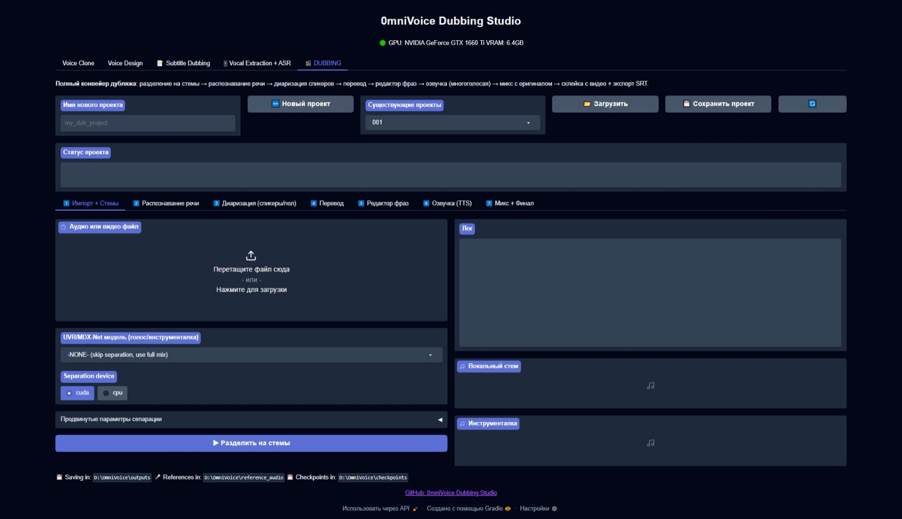

<h1 align="center">0mniDubbing-Studio</h1>
<h1 align="center">Cross-language video translation and dubbing studio with advanced features</h1>

## 🔧 About

♨️ Features:
- voice clone, design (600+ languages)
- subtitle extraction from voice (100+ languages)
- subtitle dubbing/voice overing (600+ languages)
- video and audio dubbing and voice overing (100+ languages)
- advanced subtitle edit
- advanced voice and subtitle extraction
- advanced dubbing and voice over mix
- deep and fluid work process steps with save option for future re-work or continuation
- voice diarization (up to 5 - 10 voices per scene)
- full portability (after downloading needed models)
- over 800+ pre-defined voices for dubbing/voice overing
- low VRAM usage (6Gb VRAM + 16Gb RAM+SWAP or 6Gb VRAM + 32Gb RAM)

#Coming soon.

## 📝 License

The **0mniDubbing-Studio** code will be released under Apache 2.0 License. 